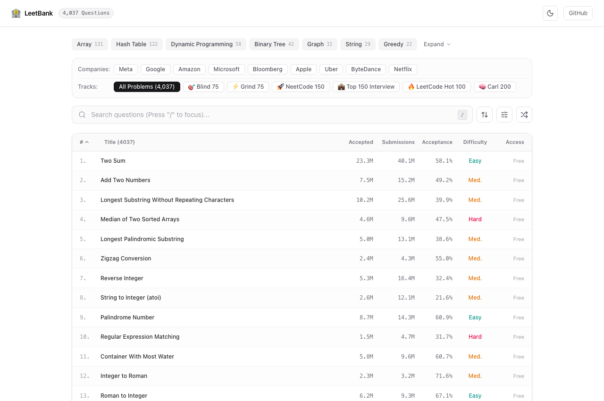
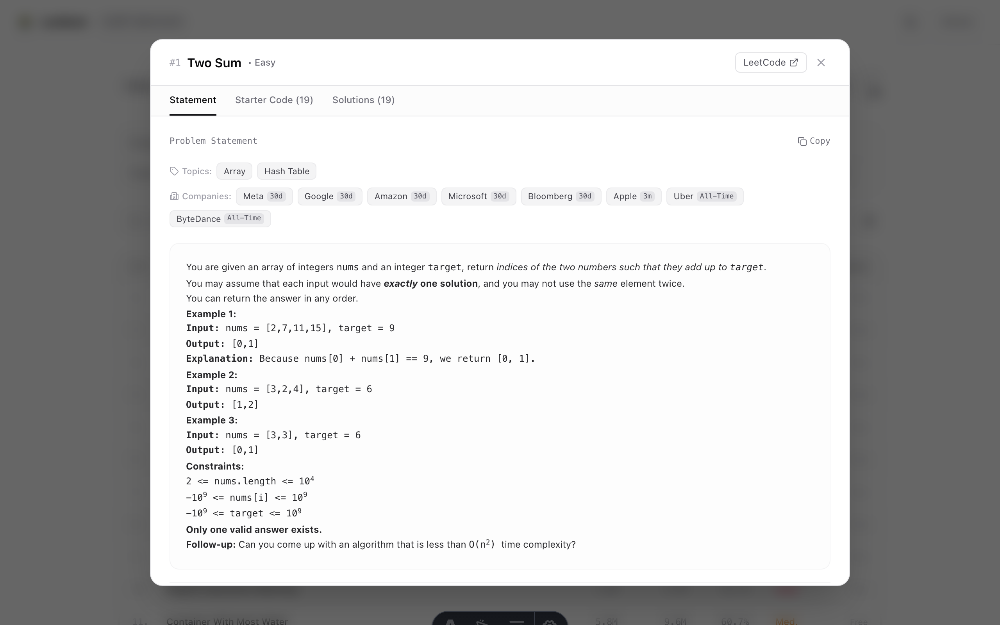
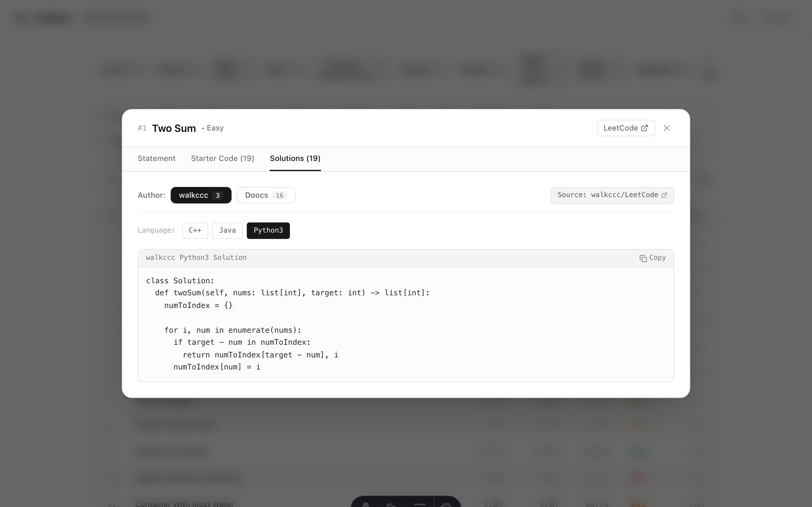
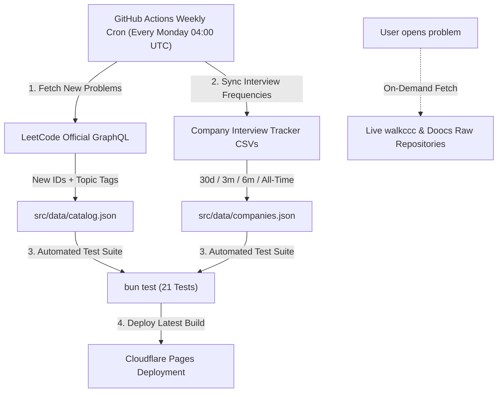
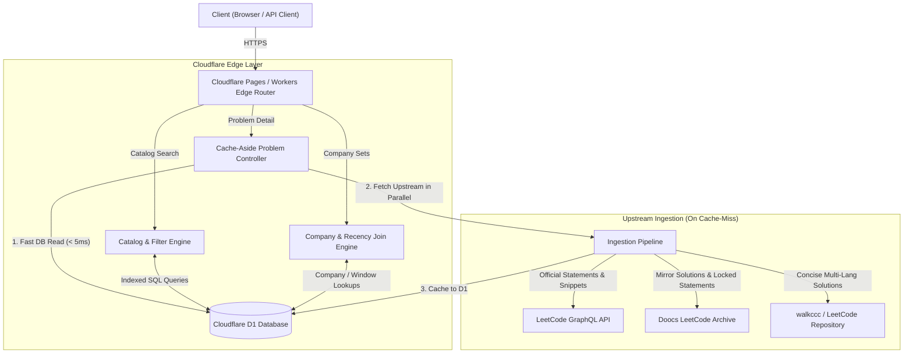

# 🏦 LeetBank

> Ultra-fast, zero-paywall LeetCode question bank with 4,037 unlocked problems, company interview tracks, multi-author reference solutions, and 19 starter code languages deployed on Cloudflare Pages and D1 Edge.

[](https://leetbank.pages.dev)
[](https://developers.cloudflare.com/d1/)
[](https://github.com/dev-ansung/leetbank/actions/workflows/deploy.yml)
[](#)
[](https://biomejs.dev)
[](#)

---

## About

LeetBank provides an instant, distraction-free environment for algorithmic practice and technical interview preparation. It unifies all 4,037 LeetCode problems (both free and locked premium questions) with multi-author reference implementations, company frequency filters, and official multi-language starter code.

### Why LeetBank?
- **Zero Paywalls**: Access complete statements, diagrams, and starter code for paywalled problems without a subscription.
- **Multi-Author Solutions**: Compare concise algorithmic implementations from **walkccc** with comprehensive 16-language archives from **Doocs**.
- **Company & Recency Filtering**: Filter questions asked in real interviews at Meta, Google, Amazon, and more across 4 recency windows.
- **Always Up to Date**: Automated weekly GitHub Actions cron synchronizes newly released contest problems, topic tags, and company frequency datasets.
- **Edge Speed**: Sub-millisecond queries powered by Cloudflare Pages and D1 SQLite.

---

## Preview

| Problemset Dashboard | Problem Statement & Details | Multi-Author Solutions |
| :---: | :---: | :---: |
|  |  |  |

---

## Features

- 🔓 **4,037 Complete Problems**: Statements, formatted examples, constraints, and follow-ups for all public and premium problems.
- 📚 **Multi-Author Solutions**: Instant toggling between **walkccc** (clean Python3, C++, Java) and **Doocs** (16 languages) with direct GitHub source links.
- 🏢 **Company Interview Sets**: Curated question frequency lists for 9 top companies (**Meta**, **Google**, **Amazon**, **Microsoft**, **Bloomberg**, **Apple**, **Uber**, **ByteDance**, **Netflix**) across 4 recency windows (**30 Days**, **3 Months**, **6 Months**, **All-Time**).
- 🎯 **Curated Practice Roadmaps**: Built-in problem tracks for **Blind 75**, **Grind 75**, **NeetCode 150**, **Top 150 Interview**, **LeetCode Hot 100**, and **Carl 200**.
- 🏷️ **Official Topic Taxonomy**: Synchronized multi-tag associations with uniform filter badges.
- 💡 **Progressive Hints & Similar Questions**: Collapsible hint disclosure cards and clickable related problems graph.
- 💻 **19 Starter Code Languages**: Official templates for `Python3`, `TypeScript`, `C++`, `Java`, `Go`, `Rust`, `Swift`, `Kotlin`, `C#`, `PHP`, `Ruby`, `Scala`, and more.
- 📋 **1-Click Markdown Copying**: Export clean GitHub Flavored Markdown problem descriptions.

---

## 🔄 Automated Data Freshness Pipeline

To ensure the problem catalog and company question sets never go stale, LeetBank runs an automated synchronization pipeline:



1. **Weekly Problemset Sync**:
   * Runs automatically every Monday at 04:00 UTC (following LeetCode's weekly contests).
   * Queries LeetCode GraphQL `problemsetQuestionList` to ingest newly published problem IDs, updated acceptance stats, and official topic tags.
2. **Company Interview Frequency Refresh**:
   * Pulls the latest frequency CSVs for Meta, Google, Amazon, Microsoft, and others across the 4 recency windows (`30 Days`, `3 Months`, `6 Months`, `All-Time`).
3. **Live Multi-Author Solutions**:
   * Solutions from `walkccc/LeetCode` and `doocs/leetcode` are pulled directly from their repositories, ensuring any upstream community additions and corrections are available immediately.
4. **Automated CI/CD Verification**:
   * Runs the full `bun test` suite and deploys the updated edge build to Cloudflare Pages automatically.

---

## Quick Start (Local Development)

### Requirements
- [Bun](https://bun.sh) (>= 1.1)

### Setup

```bash
# 1. Clone the repository
git clone https://github.com/dev-ansung/leetbank.git
cd leetbank

# 2. Install dependencies
bun install

# 3. Start local development server
bun dev
```

Open [http://localhost:4321](http://localhost:4321) in your browser.

### Running Tests & Linter

```bash
# Run test suite
bun test

# Run Biome linter check
bun run lint

# Auto-format and fix lint issues
bun run lint:fix
```

---

## Architecture



---

## API Reference

### 1. `GET /api/problems`
Search, filter, and paginate through the problem catalog.

```bash
curl -s "https://leetbank.pages.dev/api/problems?difficulty=Medium&topic=Array&limit=10" | jq .
```

| Parameter | Type | Description | Default |
| :--- | :---: | :--- | :---: |
| `difficulty` | `string` | Filter by `Easy`, `Medium`, or `Hard` | `All` |
| `topic` | `string` | Filter by topic tag (e.g. `Array`, `Dynamic Programming`) | `undefined` |
| `q` | `string` | Search query for ID, title, slug, or topic | `undefined` |
| `limit` | `number` | Number of items per page | `50` |
| `offset` | `number` | Pagination offset | `0` |

---

### 2. `GET /api/problem/:id`
Fetch complete problem detail (HTML statement, 19 starter code snippets, multi-author reference solutions, hints, similar questions).

```bash
curl -s "https://leetbank.pages.dev/api/problem/1" | jq .
```

---

### 3. `GET /api/companies`
Fetch company interview question datasets with frequency metadata.

```bash
curl -s "https://leetbank.pages.dev/api/companies?company=meta&window=30-days" | jq .
```

| Parameter | Type | Description | Default |
| :--- | :---: | :--- | :---: |
| `company` | `string` | `meta`, `google`, `amazon`, `microsoft`, `bloomberg`, `apple`, `uber`, `bytedance`, `netflix` | `undefined` |
| `window` | `string` | `30-days`, `3-months`, `6-months`, `all-time` | `all-time` |

---

### 4. `GET /api/d1-health`
Returns live Cloudflare D1 database connection telemetry and record counts.

---

## Acknowledgments

- [LeetCode](https://leetcode.com) for the original algorithmic problemset and GraphQL API.
- [walkccc/LeetCode](https://github.com/walkccc/LeetCode) by **@walkccc** for concise, high-quality multi-language reference solutions.
- [doocs/leetcode](https://github.com/doocs/leetcode) by **@doocs** for comprehensive open-source algorithmic solutions across 16 programming languages.
- [Tech Interview Handbook](https://www.techinterviewhandbook.org/grind75) by **Yangshun Tay** for the Grind 75 curriculum.
- [NeetCode](https://neetcode.io) for the NeetCode 150 practice roadmap.

---

## License

This project is open source under the [MIT License](LICENSE).  
For educational and interview preparation purposes. LeetCode is a registered trademark of LeetCode LLC.
