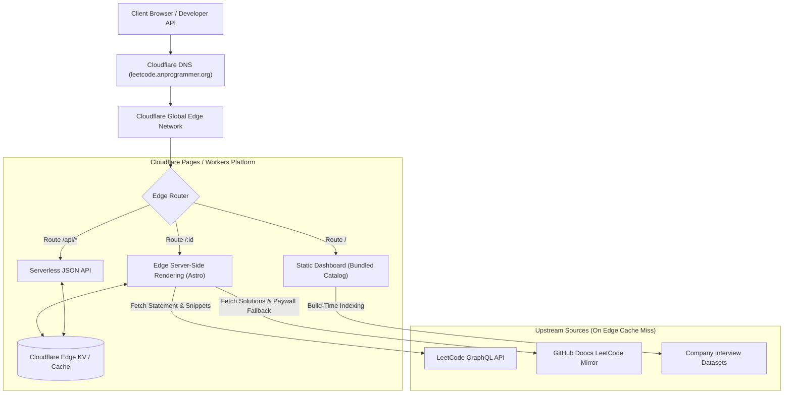

<div align="center">

# LeetBank 🏦

**The Ultra-Fast, Zero-Paywall LeetCode Question Bank & Study Platform**  
*Hosted globally on Cloudflare Edge • Live at [leetcode.anprogrammer.org](https://leetcode.anprogrammer.org)*

[](https://pages.cloudflare.com)
[](https://leetcode.anprogrammer.org)
[](https://leetcode.anprogrammer.org)
[](https://leetcode.anprogrammer.org)
[](LICENSE)

</div>

---

## ⚡ What is LeetBank?

**LeetBank** brings all the premium power of LeetCode directly to the web with zero subscriptions, zero paywalls, and sub-20ms global latency. Powered by Cloudflare Pages and Edge SSR, it gives software engineers instant access to **all 4,037 LeetCode problems**, verified multi-language reference solutions, company interview frequency rankings, and progressive study tracks.

---

## 💎 Core Capabilities

### 🔓 100% Unlocked Premium Questions
* Practice **800+ LeetCode Premium problems** (such as *#269 Alien Dictionary*, *#253 Meeting Rooms II*, *#314 Binary Tree Vertical Order Traversal*, *#271 Encode and Decode Strings*) with complete statements, test cases, and solutions.
* Transparent fallback to community mirrors guarantees you never hit a paywall popup.

### 🏢 Company-Targeted Tracks & Recency Windows
* Target your prep for **Meta**, **Google**, **Amazon**, **Microsoft**, **Bloomberg**, **Apple**, **Uber**, **ByteDance**, and **Netflix**.
* Filter questions by active interview cycle windows:
  * **Last 30 Days** (Active interview cycle hotlist)
  * **Last 3 Months** (Recent quarter interview trends)
  * **Last 6 Months** (Standard interview prep window)
  * **All-Time** (Core company classics)
* Displays exact **Frequency Percentages**, **Algorithmic Patterns** (e.g. *Prefix Sum / Sliding Window*), and **Revision Priorities**.

### 💡 16 Reference Solution Languages & Big-O Complexity
* Optimal, verified reference solutions across **16 programming languages**:
  `Python 3`, `Java`, `C++`, `Go`, `TypeScript`, `Rust`, `JavaScript`, `C#`, `PHP`, `Scala`, `Swift`, `Ruby`, `Kotlin`, `Nim`, `Cangjie`, `C`.
* Explicit **Big-O Time Complexity** ($O(N)$, $O(\log N)$) and **Space Complexity** ($O(1)$, $O(N)$) for every algorithmic approach.

### 🌐 19 Starter Code Languages
* Clean, copyable starter code templates in **19 languages**:
  `Python 3` (modernized PEP 585/604), `TypeScript`, `JavaScript`, `Go`, `Rust`, `C++`, `Java`, `C#`, `C`, `Swift`, `Kotlin`, `Ruby`, `PHP`, `Dart`, `Scala`, `Elixir`, `Erlang`, `Racket`, `SQL`.

### 🚀 Sub-20ms Edge Speed & Instant Search
* **< 1ms Client Search**: Search all 4,037 questions by ID, title, difficulty, or topic tag with zero network requests.
* **Keyboard-First Navigation**:
  * Press `/` to focus the search bar.
  * `j` / `k` or `ArrowDown` / `ArrowUp` to navigate questions.
  * `Enter` to open, `r` for a random problem, `Esc` to reset.
* **Global Edge Caching**: Dynamic question pages are cached at Cloudflare Edge locations across 300+ cities for instant load times.

### 🔌 Open Developer REST API
Programmatic JSON endpoints for IDE extensions, CLI tools, and automated study workflows:
* `GET /api/problems`: Query catalog metadata and company tags.
* `GET /api/problem/:id_or_slug`: Fetch full problem payload with statement HTML, test cases, and reference solutions.

---

## 🧭 Live URL Routing Guide

| URL Route | Purpose |
| :--- | :--- |
| `leetcode.anprogrammer.org/` | Searchable dashboard with Roadmap & Company chips |
| `leetcode.anprogrammer.org/269` | Direct access to Problem #269 by numerical ID |
| `leetcode.anprogrammer.org/alien-dictionary` | Direct access to problem by URL title slug |
| `leetcode.anprogrammer.org/api/problems` | REST API: Searchable catalog index |
| `leetcode.anprogrammer.org/api/problem/269` | REST API: Full JSON problem detail & solutions |

---

## 🏗️ Architecture & Technology Stack



* **Framework**: [Astro](https://astro.build/) (Static prerender for zero-JS dashboard + Edge SSR for dynamic problems)
* **Hosting & Runtime**: [Cloudflare Pages](https://pages.cloudflare.com/) / Cloudflare Workers Edge Runtime
* **Edge Storage**: Cloudflare KV Cache
* **Language & Package Manager**: TypeScript + [Bun](https://bun.sh/)
* **Deployment**: [Wrangler CLI](https://developers.cloudflare.com/workers/wrangler/)

---

## 📂 Project Structure

```text
leetbank/
├── docs/
│   ├── cuj.md                 # Critical User Journeys
│   ├── data_model.md          # TypeScript schemas & entity definitions
│   ├── data_flow.md           # Sequence diagrams & caching lifecycle
│   ├── hld.md                 # High-Level Design & topology
│   └── lld.md                 # Low-Level Design & modules
├── src/
│   ├── data/
│   │   ├── catalog.json       # 4,037 Canonical problems database
│   │   ├── companies/         # Company-tagged frequency datasets
│   │   └── tracks/            # Blind 75, NeetCode 150, Grind 75
│   ├── lib/
│   │   ├── fetcher.ts         # LeetCode GraphQL + Doocs Mirror fetcher
│   │   ├── cache.ts           # Cloudflare KV Edge Cache client
│   │   ├── modernizer.ts      # Python 3.14 PEP 8/585/604 AST modernizer
│   │   └── html-cleaner.ts    # HTML entity decoder (&quot; -> \")
│   ├── components/            # UI components (Table, CodeViewer, Tabs)
│   └── pages/                 # Edge routes (/, /:id, /api/*)
├── astro.config.mjs           # Astro + Cloudflare Adapter configuration
├── wrangler.jsonc             # Cloudflare Pages deployment configuration
└── package.json
```

---

## 🛠️ Local Development & Deployment

### Prerequisites
* [Bun](https://bun.sh/) installed (`curl -fsSL https://bun.sh/install | bash`)
* [Wrangler CLI](https://developers.cloudflare.com/workers/wrangler/) authenticated (`npx wrangler login`)

### Setup & Run
```bash
# 1. Clone repository
git clone https://github.com/your-username/leetbank.git
cd leetbank

# 2. Install dependencies
bun install

# 3. Start local development server
bun dev
```

### Deploy to Cloudflare Pages
```bash
# Build & deploy globally
bun run build
bunx wrangler pages deploy dist --project-name leetbank
```

---

## 📄 Documentation

For deep technical specifications, refer to the [docs/](docs/) directory:
* [Critical User Journeys (CUJ)](docs/cuj.md)
* [Data Model & Schemas](docs/data_model.md)
* [Data Flow & Caching](docs/data_flow.md)
* [High-Level Design (HLD)](docs/hld.md)
* [Low-Level Design (LLD)](docs/lld.md)

---

## ⚖️ License

Distributed under the MIT License. See `LICENSE` for more information.
