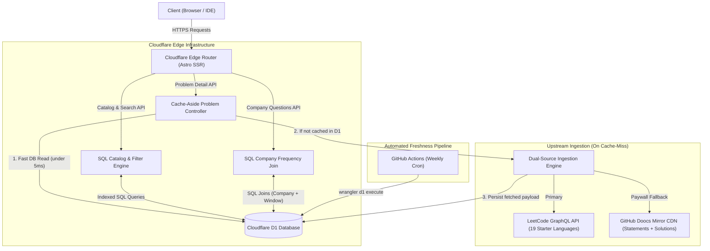
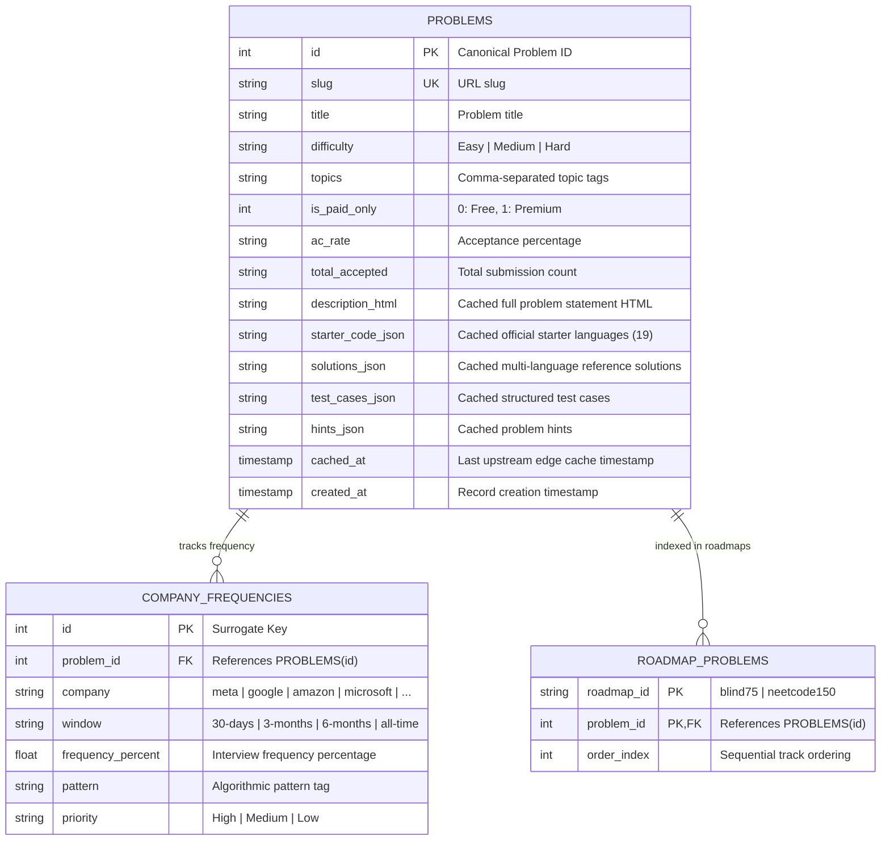

# 🏦 LeetBank

> Ultra-fast, zero-paywall LeetCode question bank and interview preparation platform deployed on **Cloudflare Edge** with **Cloudflare D1 SQL Database**.

---

## 🏛️ High-Level System Architecture (HLD)

LeetBank is built as an edge-native application leveraging Cloudflare's serverless infrastructure:

---

## 🗄️ Data Model

Cloudflare D1 (Globally Replicated SQLite) persists the canonical catalog, company frequency mappings, and cached problem statements:

---

## 🔄 Core Data Flows

### 1. Problem Detail Cache-Aside Pattern (`GET /api/problem/:id`)
1. **D1 Read**: Worker queries `SELECT * FROM problems WHERE id = ? OR slug = ?`.
2. **Cache Hit**: If `description_html` and `starter_code_json` are populated, returns the cached payload in **$< 5\text{ms}$**.
3. **Cache Miss**:
   * Fetches official starter code and metadata from LeetCode GraphQL.
   * If locked or solutions missing, queries GitHub Doocs Mirror CDN.
   * Parses statements, test cases, and Big-$O$ complexity.
   * Asynchronously updates D1 with the parsed payload so subsequent hits worldwide are instant.

### 2. Company Filtering & Ranking (`GET /api/companies?company=amazon&window=30-days`)
* Executes an indexed SQL join between `problems` and `company_frequencies` ordered by `frequency_percent DESC`.

---

## 🚀 Live Endpoints

| Route | Description | Latency |
| :--- | :--- | :---: |
| **`GET /`** | Interactive Dashboard (Search, Tracks, Companies, Topics) | $< 10\text{ms}$ |
| **`GET /:id`** | Dynamic Edge SSR Problem View (e.g. `/234`, `/269`) | $< 50\text{ms}$ |
| **`GET /api/problems`** | SQL Catalog Filter & Pagination API | $< 15\text{ms}$ |
| **`GET /api/problem/:id`** | Problem Detail (Statements, 19 Starter Code, Solutions) | $< 5\text{ms}$ (Cached) |
| **`GET /api/companies`** | Company Interview Frequencies & Pattern Tags | $< 10\text{ms}$ |
| **`GET /api/d1-health`** | Cloudflare D1 Live Connection Telemetry | $< 6\text{ms}$ |

---

## 💻 Tech Stack

* **Edge Hosting**: [Cloudflare Pages](https://pages.cloudflare.com/) + [Cloudflare Workers](https://workers.cloudflare.com/)
* **Database**: [Cloudflare D1](https://developers.cloudflare.com/d1/) (Edge SQLite)
* **Framework**: [Astro 5](https://astro.build/) (Edge SSR Mode) + [React 19](https://react.dev/)
* **Styling**: [Tailwind CSS v4](https://tailwindcss.com/) + [shadcn-ui](https://ui.shadcn.com/) design tokens
* **Testing**: [Bun Test](https://bun.sh/) (22 unit & integration tests)
