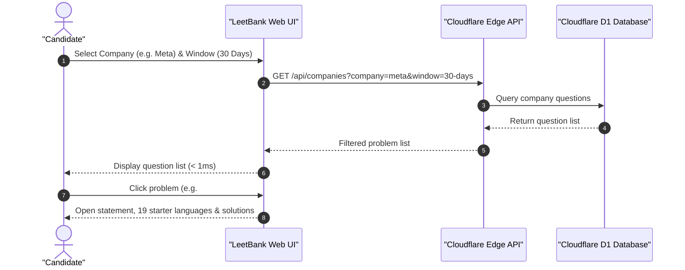

# 🏦 LeetBank

> Fast, free LeetCode question bank with 4,000+ problems, company-curated tracks, 19 starter code languages, and reference solutions on Cloudflare Edge.

[](https://github.com/dev-ansung/leetbank/actions/workflows/deploy.yml)
[](https://leetbank.pages.dev)
[](https://developers.cloudflare.com/d1/)
[](#)
[](#)

---

## 📸 Preview

| Problemset Dashboard | Problem Detail & Solutions |
| :---: | :---: |
|  |  |

---

## ⚡ Key Features

* 🔓 **4,037 Problems**: Full problem statements, test cases, and diagrams for free and premium questions.
* 🏢 **Company-Curated Sets**: Question sets across 9 companies (**Meta**, **Google**, **Amazon**, **Microsoft**, **Bloomberg**, **Apple**, **Uber**, **ByteDance**, **Netflix**) with 4 recency windows (**30 Days**, **3 Months**, **6 Months**, **All-Time**).
* 🥞 **Curated Practice Roadmaps**: Built-in tracks for **Blind 75**, **Grind 75**, **NeetCode 150**, **Top 150 Interview**, **LeetCode Hot 100**, and **Carl 200**.
* 🎛️ **Fast Filtering & Sorting**: Filter by topic, difficulty, access, and company. Sort by Question ID, Total Accepted, Total Submissions, and Acceptance Rate.
* 💻 **19 Starter Code Languages**: Official templates for `Python3`, `TypeScript`, `Go`, `Rust`, `C++`, `Java`, `Swift`, `Kotlin`, and more.
* 💡 **Reference Solutions**: Multi-language implementations with time and space complexity breakdown.
* 📋 **1-Click Markdown & Test Cases**: Copy complete problem statements as formatted GitHub Markdown, along with example test inputs/outputs.

---

## 🎯 Critical User Journey (CUJ)

### Company-Targeted Practice
> **Goal**: Practice interview questions curated for a specific company and timeframe.



1. **Select Target Company & Recency Window**:
   * Open `https://leetbank.pages.dev/`.
   * Click **Meta** and select the **30 Days** recency window.
2. **Review Curated Questions**:
   * The catalog displays questions associated with the company and window.
3. **Practice & Review**:
   * Click any question to inspect the statement, test cases, starter code in your language of choice, and reference solutions.

---

## 🏛️ System Architecture


---

## 🔌 API Reference

### 1. `GET /api/problems`
Search and paginate through the problem catalog.

| Parameter | Type | Description | Default |
| :--- | :---: | :--- | :---: |
| `difficulty` | `string` | Filter by `Easy`, `Medium`, or `Hard` | `All` |
| `topic` | `string` | Filter by topic tag (e.g. `Array`, `Graph`) | `undefined` |
| `q` | `string` | Search query for ID, title, or slug | `undefined` |
| `limit` | `number` | Items per page | `50` |
| `offset` | `number` | Pagination offset | `0` |

---

### 2. `GET /api/problem/:id`
Fetch complete problem detail (HTML statement, starter code in 19 languages, reference solutions, test cases).

```bash
curl -s "https://leetbank.pages.dev/api/problem/269" | jq .
```

---

### 3. `GET /api/companies`
Fetch company question datasets.

| Parameter | Type | Description | Default |
| :--- | :---: | :--- | :---: |
| `company` | `string` | `meta`, `google`, `amazon`, `microsoft`, `bloomberg`, `apple`, `uber`, `bytedance`, `netflix` | `undefined` |
| `window` | `string` | `30-days`, `3-months`, `6-months`, `all-time` | `all-time` |

---

### 4. `GET /api/d1-health`
Returns live Cloudflare D1 database connection telemetry and record counts.

---

## 🛠️ Local Development

```bash
# 1. Clone repository
git clone https://github.com/dev-ansung/leetbank.git
cd leetbank

# 2. Install dependencies
bun install

# 3. Run automated tests
bun test

# 4. Start local development server
bun dev
```

---

## 📄 License

This project is licensed under the [MIT License](LICENSE).
