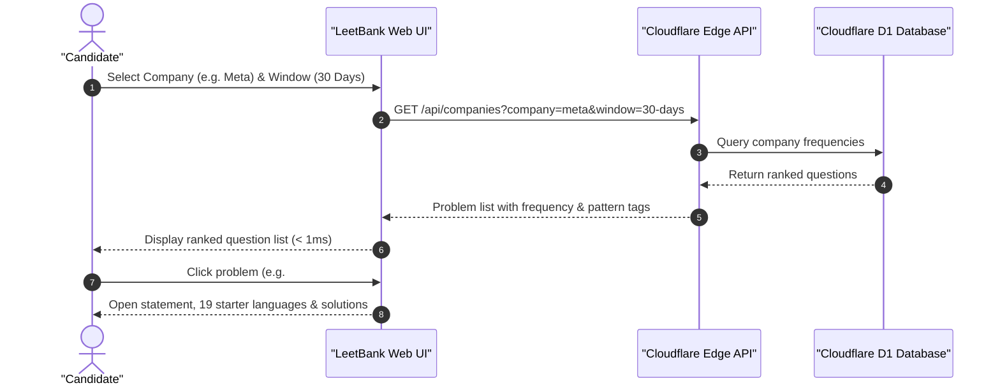

# 🏦 LeetBank

> Fast, free LeetCode question bank and interview preparation platform deployed on **Cloudflare Edge** with **Cloudflare D1 SQL Database**.

[](https://github.com/dev-ansung/leetbank/actions/workflows/deploy.yml)
[](https://leetbank.pages.dev)
[](https://developers.cloudflare.com/d1/)
[](#)
[](#)

---

## ⚡ Features

LeetBank provides a complete, fast environment for coding interview preparation:

* 🔓 **4,037 Questions**: Full problem statements, test cases, and diagrams for free and premium LeetCode questions.
* 🏢 **Top Tech Company Tracks**: Interview frequency data across 9 companies (**Meta**, **Google**, **Amazon**, **Microsoft**, **Bloomberg**, **Apple**, **Uber**, **ByteDance**, **Netflix**).
* 📅 **4 Recency Windows**: Filter questions asked in the **Last 30 Days**, **3 Months**, **6 Months**, and **All-Time**.
* 🥞 **Curated Roadmaps**: Built-in practice tracks for **Blind 75** and **NeetCode 150**.
* 🧩 **Topic Filtering**: Filter questions by algorithm patterns and data structures (**Array**, **Hash Table**, **Dynamic Programming**, **Binary Tree**, **Graph**, etc.).
* 💻 **19 Programming Languages**: Official starter templates for `Python3`, `TypeScript`, `Go`, `Rust`, `C++`, `Java`, `Swift`, `Kotlin`, and more.
* 💡 **Solutions & Big-$O$ Complexity**: Reference implementations with time and space complexity analysis.
* 📋 **1-Click Test Case Copying**: Structured example inputs and expected outputs ready to paste into your local editor.
* 🌓 **Dark & Light Mode**: Fast, responsive monochrome interface.

---

## 🎯 Critical User Journey (CUJ)

### Company-Targeted Interview Sprint
> **Goal**: A candidate preparing for an upcoming technical interview practices the most frequently asked questions for their target company within a specific timeframe.



1. **Select Target Company & Recency Window**:
   * Open `https://leetbank.pages.dev/`.
   * Click **Meta** and select the **30 Days** recency window.
2. **Review High-Yield Questions**:
   * The catalog displays questions ordered by interview frequency percentage:
     * **#1249 Minimum Remove to Make Valid Parentheses** (100% Frequency • *Sorting / Prefix / Scan*)
     * **#339 Nested List Weight Sum** (85% Frequency • *Two Pointers / Recursion*)
     * **#1 Two Sum** (75% Frequency • *Hash Table / Two Pointers*)
3. **Practice & Review**:
   * Click any question to inspect the complete statement, structured test cases, 19 starter code languages, and verified reference solutions with Big-$O$ complexity.

---

## 🏛️ High-Level System Architecture (HLD)

LeetBank runs entirely on Cloudflare's serverless edge infrastructure:


---

## 🔌 Edge REST API Reference

All API routes return standard JSON with edge caching headers.

### 1. `GET /api/problems`
Search and paginate through the problem catalog.

| Parameter | Type | Description | Default |
| :--- | :---: | :--- | :---: |
| `difficulty` | `string` | Filter by `Easy`, `Medium`, or `Hard` | `All` |
| `topic` | `string` | Filter by topic tag (e.g. `Array`, `Graph`) | `undefined` |
| `q` | `string` | Search query for ID, title, or slug | `undefined` |
| `limit` | `number` | Items per page | `50` |
| `offset` | `number` | Pagination offset | `0` |

---

### 2. `GET /api/problem/:id`
Fetch complete problem detail (HTML statement, starter code in 19 languages, reference solutions, test cases).

```bash
curl -s "https://leetbank.pages.dev/api/problem/269" | jq .
```

<details>
<summary>Sample JSON Response</summary>

```json
{
  "id": 269,
  "slug": "alien-dictionary",
  "title": "Alien Dictionary",
  "difficulty": "Hard",
  "topics": ["Array", "String", "Graph", "Topological Sort"],
  "isPaidOnly": true,
  "descriptionHtml": "<p>There is a new alien language that uses the English alphabet...</p>",
  "starterCode": {
    "python3": "class Solution:\n    def alienOrder(self, words: List[str]) -> str:\n        pass",
    "typescript": "function alienOrder(words: string[]): string {\n    \n};",
    "golang": "func alienOrder(words []string) string {\n    \n}"
  },
  "solutions": [
    {
      "language": "Python3",
      "langSlug": "python3",
      "code": "class Solution:\n    def alienOrder(self, words: List[str]) -> str:\n        ...",
      "timeComplexity": "O(N + |Σ|)",
      "spaceComplexity": "O(|Σ|)"
    }
  ],
  "testCases": [
    {
      "id": 1,
      "name": "Example 1",
      "input": "words = [\"wrt\",\"wrf\",\"er\",\"ett\",\"rftt\"]",
      "expected": "\"wertf\""
    }
  ],
  "source": "d1_cache"
}
```
</details>

---

### 3. `GET /api/companies`
Fetch company interview frequency datasets.

| Parameter | Type | Description | Default |
| :--- | :---: | :--- | :---: |
| `company` | `string` | `meta`, `google`, `amazon`, `microsoft`, `bloomberg`, `apple`, `uber`, `bytedance`, `netflix` | `undefined` |
| `window` | `string` | `30-days`, `3-months`, `6-months`, `all-time` | `all-time` |

---

### 4. `GET /api/d1-health`
Returns live Cloudflare D1 database connection telemetry and record counts.

---

## 🔄 Automated Data Sync & Deployment

LeetBank uses GitHub Actions to keep company interview questions up to date and deploy automatically:

* **Workflow**: [`.github/workflows/deploy.yml`](.github/workflows/deploy.yml)
* **Schedule**: Runs automatically every Monday at `04:00 UTC` and on every push to `main`.
* **Process**:
  1. Synchronizes latest company interview frequency datasets.
  2. Runs the automated test suite.
  3. Builds the Astro Edge SSR application.
  4. Deploys directly to Cloudflare Pages.

---

## 🛠️ Local Development

```bash
# 1. Clone repository
git clone https://github.com/dev-ansung/leetbank.git
cd leetbank

# 2. Install dependencies
bun install

# 3. Run automated tests
bun test

# 4. Start local development server
bun dev
```

---

## 📄 License

This project is licensed under the [MIT License](LICENSE).
