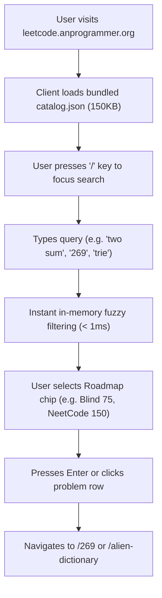
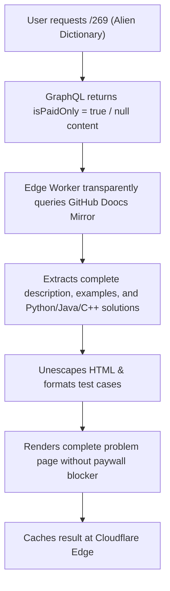

# Critical User Journeys (CUJs) - LeetBank

This document defines the 4 core Critical User Journeys (CUJs) for **LeetBank** (`leetcode.anprogrammer.org`), a high-performance Cloudflare-hosted LeetCode question bank and interactive study dashboard.

---

## CUJ 1: Instant Dashboard Discovery & Filtering (`GET /`)

### User Goal
Quickly locate a target question or explore curated practice tracks among 4,037 indexed LeetCode problems without lag or page reloads.

### User Flow


### Key Requirements & Constraints
* **0 Network Requests**: Dashboard search executes strictly in client memory.
* **Keyboard-First Ergonomics**:
  * `/` focuses search bar.
  * `j` / `k` or `ArrowDown` / `ArrowUp` navigates table rows.
  * `Enter` opens the selected problem.
  * `r` selects a random problem.
  * `Esc` clears filters and search queries.
* **Curated Roadmap Pills**: Instant single-click filtering for Blind 75, NeetCode 150, Grind 75, and Top Interview 150.

---

## CUJ 2: Direct Problem Study & Multi-Language Practice (`GET /:id_or_slug`)

### User Goal
Read a clean, distraction-free problem statement with mathematical formulas, inspect decoded example test cases, switch starter templates across 19 languages, reveal hints, and examine reference solutions.

### User Flow
```mermaid
flowchart TD
    A["User navigates to /269 or /alien-dictionary"] --> B["Edge Worker checks Cloudflare Cache"]
    B -->|Cache Hit (< 20ms)| C["Renders pre-cached Problem Page"]
    B -->|Cache Miss| D["Lazy-fetches upstream statement & solutions"]
    D --> E["Populates Edge Cache (7-day TTL)"]
    E --> C
    C --> F["User reads problem statement with KaTeX math"]
    C --> G["Inspects decoded test cases (JSON inputs & outputs)"]
    C --> H["Switches starter code language tab (Python / TS / Go / Rust / C++)"]
    C --> I["Clicks 'Copy Code' or 'Open in VS Code'"]
    C --> J["Reveals progressive hint accordion"]
    C --> K["Views optimal reference solution and Big-O complexity"]
```

### Key Requirements & Constraints
* **Clean Typography & Math**: Renders KaTeX LaTeX mathematical expressions seamlessly without visual distortion.
* **Decoded Test Cases**: No raw HTML entities (e.g. `&quot;bab&quot;` must be rendered as `"bab"`).
* **Multi-Language Selector**:
  * 19 starter code languages from official LeetCode snippets.
  * 16 reference solution languages with Big-O time and space complexity annotations.
* **Actionable Controls**: One-click "Copy Code Snippet", "Copy JSON Test Cases", and "Open in VS Code" handler.

---

## CUJ 3: Paywall & Premium Problem Bypass

### User Goal
Access locked/premium LeetCode problems (e.g. `#269 Alien Dictionary`, `#253 Meeting Rooms II`) with complete descriptions and verified reference solutions.

### User Flow


### Key Requirements & Constraints
* **Automatic Fallback**: Zero user intervention required; the system falls back to the mirror on any 403, paywall flag, or empty GraphQL response.
* **Parity**: Premium questions feature the same rich test cases and multi-language solution tabs as free questions.

---

## CUJ 4: Developer & Automation JSON API (`GET /api/...`)

### User Goal
Programmatically retrieve problem metadata, statements, test cases, and code templates for IDE extensions, CLI tools, or automated scripts.

### Endpoints
* `GET /api/problems`: Returns the lightweight catalog index (filterable by `difficulty`, `topic`, `roadmap`, `search`).
* `GET /api/problem/:id_or_slug`: Returns hydrated problem JSON payload with statement HTML, test cases, starter code map, and reference solutions.
