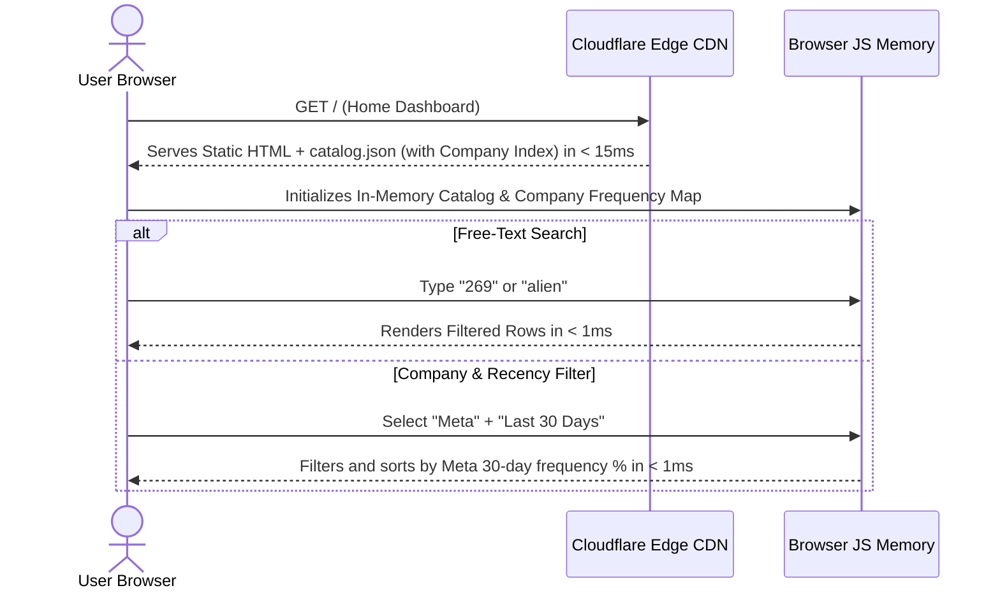

# Data Flow Architecture - LeetBank

This document details the data lifecycle, edge resolution, and caching pipelines for **LeetBank**.

---

## 1. Dashboard Search & Company Filter Data Flow (`GET /`)



---

## 2. Dynamic Problem Edge Resolution (`GET /:id_or_slug`)

```mermaid
sequenceDiagram
    actor User as User Browser
    participant Router as Cloudflare Edge Worker
    participant Cache as Cloudflare KV / Edge Cache
    participant GraphQL as LeetCode Official API
    participant Mirror as GitHub Doocs Mirror

    User->>Router: GET /269
    Router->>Router: Normalize ID/Slug to Canonical "problem:269"
    Router->>Cache: Query Key "problem:269"

    alt Cache Hit (< 20ms)
        Cache-->>Router: Returns Cached ProblemDetail Payload
    else Cache Miss (First Visitor)
        Router->>GraphQL: Query questionData(titleSlug="alien-dictionary")
        alt Problem is Paid / Locked
            GraphQL-->>Router: isPaidOnly=true / content=null
            Router->>Mirror: GET README_EN.md from Doocs Repository
            Mirror-->>Router: Markdown Statement + Multi-Language Solutions
        else Problem is Public
            GraphQL-->>Router: Statement HTML + 19 Starter Snippets + Stats + Hints
            Router->>Mirror: GET README_EN.md (for 16 Reference Solutions & Complexity)
            Mirror-->>Router: Solutions & Big-O Annotations
        end
        Router->>Router: Decode HTML Entities (&quot; -> ")
        Router->>Router: Modernize Python 3.14 Code & Format Test Cases
        Router->>Cache: Store in Cloudflare Cache (TTL: 7 Days)
    end

    Router-->>User: Render Clean SSR Page with Tabs & Copy Actions
```

---

## 3. Cache Eviction & Invalidation Strategy
* **TTL Policy**: Cached problem entities remain valid for 7 days (`max-age=604800, stale-while-revalidate=86400`).
* **Manual Purge**: A purge endpoint `/api/admin/purge/:id` allows purging stale entries when upstream problem definitions are updated.
