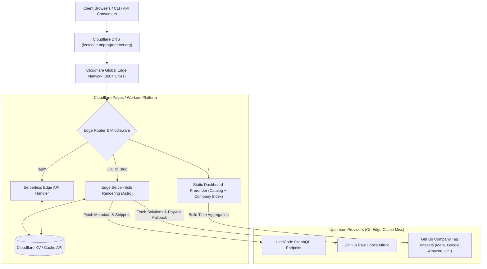

# High-Level Design (HLD) - LeetBank

This document defines the high-level system architecture, hosting topology, domain routing, and infrastructure boundaries for **LeetBank**.

---

## 1. System Topology

---

## 2. Infrastructure Components

### A. Cloudflare Edge Runtime
* **Platform**: Cloudflare Pages with `@astrojs/cloudflare` edge adapter.
* **Benefits**:
  * Free tier with zero server costs.
  * Cold start latency < 5ms worldwide.
  * Automatic HTTPS, SSL/TLS, and DDoS protection.

### B. Custom Domain & DNS
* **Domain**: `leetcode.anprogrammer.org`
* **Apex Zone**: `anprogrammer.org` (managed under Cloudflare Account `6a61ba2ae8edd10e314785eb1f7734a9`).
* **Routing**: CNAME `leetcode` proxied (`Orange Cloud`) directly to Cloudflare Pages deployment.

### C. Data Persistence & Caching
* **Static Layer**: `catalog.json` (4,037 problems + company frequency mappings) bundled in the client static bundle.
* **Edge Storage Layer**: Cloudflare KV namespace `LEETBANK_CACHE` storing JSON snapshots of hydrated questions.
